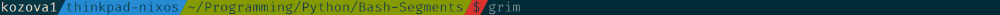

# Bash-Segments - Another bash prompt framework
Bash-Segments is a small (less than 200 significant python lines of code) framework for customizing bash prompts. It reads a configuration from a TOML or JSON  file and creates a prompt based on it. 
## Installation
1. Install `python-toml` by either getting it from your package manager or by running `pip3 install --user toml`
2. Clone the git repository and make sure you have python 3 installed:
```bash
git clone https://github.com/Kozova1/Bash-Segments ~/.local/share/bash-segments
```
3. Create a new config in `$XDG_CONFIG_HOME/bash-segments/prompt.toml` or `$XDG_CONFIG_HOME/bash-segments/prompt.json` or copy the example one to there. If the config is not found in `$XDG_CONFIG_HOME`, it will try to load it from `~/.config/bash-segments/prompt.toml` or `~/.config/bash-segments/prompt.json`.
4. Add execution permissions to `~/.local/share/bash-segments/segments.py` by running `chmod +x ~/.local/share/bash-segments/segments.py`.
5. Add the following line to your bashrc and restart your shell (or source the bashrc again):
```bash
eval $(~/.local/share/bash-segments/segments.py)
```
## Configuration
The configuration is written using either JSON or TOML, with preference given to TOML.
There is some top level config:
- `separator` - (string, default: `"|"`) A character that acts as a separator between segments.
- `separator_inverse` - (boolean, default: `false`) Whether to swap between the foreground and background color of the separator - required for some powerline symbols to render correctly.
- `space_at_end` - (boolean, default: `true`) Whether to add a space after the prompt.
- `segments` - (list of segments, default: `[]`) What segments to put in the prompt.
- `background_color` - (int, default: `0`) The background color of the terminal, needed for the end of the prompt.
### Segments
The segments consist of 3 or 4 values. In TOML, they are represented using table arrays, for details look [here](https://github.com/toml-lang/toml#user-content-array-of-tables). Here are the available properties:
- `background` - (int, default: `0`) The background color of the segment (and `separator`).
- `foreground` - (int, default: `1`) The foreground color of the segment (and `separator`).
- `type` - (string, default `"custom"`) The type of the module to show. If `type` is not `"custom"`, `content` will be ignored. The available types are listed [here.](./TYPES.md)
- `content` - (string, default: `"?"`) The contents of the segment. Can include bash escape sequences, as described in [this section in the bash manual.](https://www.gnu.org/savannah-checkouts/gnu/bash/manual/bash.html#index-prompting) Do not forget to escape these sequences so that your config doesn't get messed up. ***Will be ignored if*** `type = "custom"` ***is not set!***
The segments are drawn in the order that they appear in the config file.
### Colors
Execute `~/.local/share/bash-segments/colors.py` to print the color palette.
[Example TOML config](./prompt.toml)
```toml
separator = ""
separator_inverse = false
background_color = 8
space_at_end = false

[[segments]]
type = "username"
background = 0
foreground = 7

[[segments]]
type = "hostname-short"
background = 4
foreground = 0

[[segments]]
type = "directory"
background = 2
foreground = 0

[[segments]]
type = "$"
background = 1
foreground = 0
```

[Example JSON Config](./prompt.json)
```json
{
	"separator": "",
	"separator_inverse": false,
	"background_color": 8,
	"space_at_end": false,
	"segments": [
		{
			"type": "username",
			"background": 0,
			"foreground": 7
		},
		{
			"type": "hostname-short",
			"background": 4,
			"foreground": 0
		},
		{
			"type": "directory",
			"background": 2,
			"foreground": 0
		},
		{
			"type": "$",
			"background": 1,
			"foreground": 0
		}
	]
}
```
